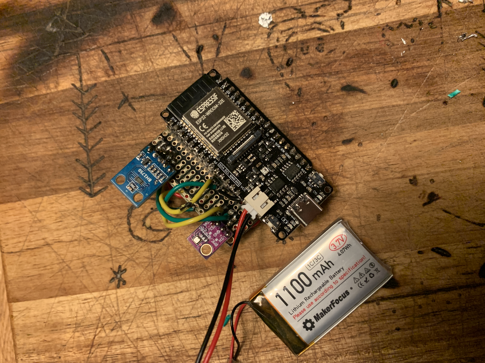

# HelloGreenHouse : ESP32 greenhouse automation

A simple playground for some of my DYI greenhouse automations. One of my favorite hobbies is spending time outside in our garden
 or in our small greenhouse. Although it's not a big one i am always surprised on how much can grow in such a minimal space 🌱

Out of curiousity I started creating some automated help to promote the growth of my plants/seedlings, primarily focussed on adding
light at earlier stages and watering on specific intervals. Although i really enjoyed creating this, and there are tons of other things
 you can add like soil-humidity measuring, adding heat pads etc... I came to the conclusion that I prefer gardening/spending time in my
  my greenhouse without involving tech, maybe only intervalled watering when i'm on vacation for some weeks 🙃 

## Capabilites

* Switch water valves manually or time based
* Switch LED strips manually or lux based
* Measure inside temperature
* Measure inside humidity
* API to operate externally
* API to retrieve metrics

## Greenhouse involved hardware

* 12V Solenoid valve attached to main water system
* 12V submersible pump inside water bucket or small tank
* 12V Old Car Battery
* 12V BLUE RED LED STRIPS
* 120W SOLAR PANEL + inventer
* 4 Channel Relay (elegoo)
* ESP32 Firebeetle2 (with external battery)
* BME280 temp sensor  
* BH1750 light/lux sensor

## Configuration

### WIFI

Change `wireless.json` inside the `settings` directory, and specify your AP SSID and PASSWORD like this;

```json
{
    "SSID": "SSID_GOES_HERE",
    "PASSWORD": "PASSWORD_GOES_HERE"
}
```

### HARDWARE\SENSOR specific

Change `profile.json` inside the `settings` directory, and specify the needed values ;

```json
{
    "temperaturePin": 17,
    "luxSclPin": 7,
    "luxSdaPin": 6,
    "lightMode": "lux", 
    "waterMode": "time",
    "waterDurationSeconds": 30,
    "waterTimes": [
        "11:45"
      ],
    "waterValve1": "off",
    "waterValve2": "off",
    "waterValve1Pin": 21,
    "waterValve2Pin": 20,    
    "ledLuxLevel": 1,
    "ledLuxBackoffSeconds": 20,
    "ledStrip1": "off",
    "ledStrip2": "off",
    "ledStrip1Pin": 23,
    "ledStrip2Pin": 22
}
```

I will explain the configuration KEYs :

```yaml
temperaturePin : specific PIN.OUT to read temperature from bme sensor
luxSclPin : specific PIN.OUT to set serial clock signal speed for lux sensor
luxSdaPin : specific PIN.OUT to read actual lux level
lightMode : can be either `lux` or `manual`, use lux level to turn on/off LED strips
waterMode : can be either `time` or `manual`
waterDurationSeconds : duration of time water valves or open (seconds)
waterTimes : list times when to open waterValves
waterValve1 : can be either `on` or `off`, used when waterMode is `manual` to open valves manually
waterValve2 : can be either `on` or `off`, used when waterMode is `manual` to open valves manually
waterValve1Pin : specific PIN.OUT to turn on/off hardware Valve1
waterValve2Pin : specific PIN.OUT to turn on/off hardware Valve2
ledLuxLevel : threshold on when to turn on light/LED strip
ledLuxBackoffSeconds : backoff timer to avoid state flapping on/off of light
ledStrip1 : can be either `on` or `off`, used when lightMode is `manual` to on/off light
ledStrip2 : can be either `on` or `off`, used when lightMode is `manual` to on/off light
ledStrip1Pin : specific PIN.OUT to turn on/off light/LED strip
ledStrip2Pin : specific PIN.OUT to turn on/off light/LED strip
```

## impression / some pictures 📸

<p align="center">
  
  
  
  
  
  
  
  
  
  
  
</p>
